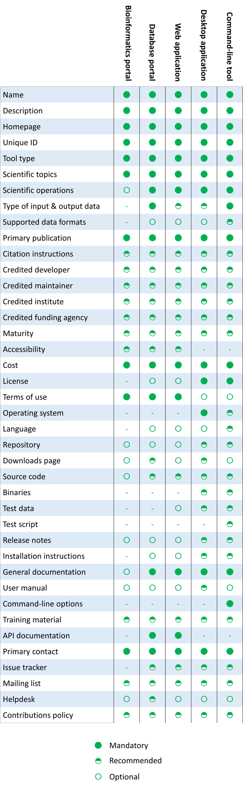
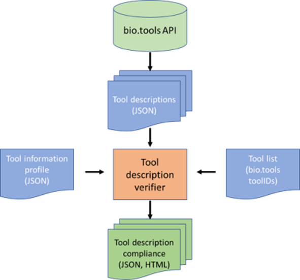

# Tool Information Profiles

A *tool information profile* is a JSON document which specifies which tool attributes - defined in [biotoolsSchema](https://github.com/bio-tools/biotoolsSchema) and also listed in the file [tool_attributes.json](https://github.com/bio-tools/Tool-Information-Profiles/blob/master/tool_attributes.json) - should be specified for different types of tools within a set of tool descriptions.

Within a profile, biotoolsSchema [attributes](https://biotoolsschema.readthedocs.io/en/latest/biotoolsschema_elements.html#) may be specified for different [tool types](https://biotoolsschema.readthedocs.io/en/latest/controlled_vocabularies.html#tool-type) as:  
* **Mandatory** - the attribute **MUST** be defined
* **Recommended** - the attribute **SHOULD** be defined
* **Optional** - the attribute **MAY** be defined
* **Not applicable** - the attribute is not relevant to this tool set and **MUST NOT** be defined.

The key words "MUST", "MUST NOT", "SHOULD", and "MAY", and "OPTIONAL" are to be interpreted as described in [RFC 2119](http://www.ietf.org/rfc/rfc2119.txt):

* "MUST" means that the guideline is an absolute requirement of the specification.
* "MUST NOT" mean that the guideline is an absolute prohibition of the specification.
* "SHOULD" mean that there may exist valid reasons in particular circumstances to ignore a particular guideline, but the full implications must be understood and carefully weighed before doing so.
* "MAY mean that the guideline is truly optional; you can choose to follow it or not.

Tool information profiles **MUST** comply with the Tool Information Profile Schema (a JSON schema), which supports *all* of the biotoolsSchema attributes.

# Example
An information graphic derived from the [IFB Tool Information Profile](https://github.com/bio-tools/Tool-Information-Profiles/blob/master/profiles/ifbToolInfoProfile.json) is shown below:

# Application
We anticipate the tool information profiles will be used by a tool description verification service which will provide a sustainable method for reporting on tool description quality within a corpus of tools.

It will take as input 1) a list of bio.tools tool IDs and 2) a tool information profile, and produce as output a report on the compliance of the tool descriptions to the standard, in human and machine-readable formats. Tool descriptions will be consumed in JSON or JSON-LD format, *e.g.* by invoking the [bio.tools](https://bio.tools) API, or from a *bio.tools* data dump.

# Documentation (for stable version 1.0.0)
Comprehensive documentation is available: 
* [Technical docs](http://bio-tools.github.io/Tool-Information-Profiles/) (built from files under [/stable/docs](https://github.com/bio-tools/Tool-Information-Profiles/tree/master/stable/docs))

# Files

File                            | Description
----                            | -----------
toolInfoProfileSchema_dev.json  | Tool Information Profile Schema - dev version (JSON schema)
stable                          | Current stable version of the schema + docs 
stable/examples                 | Example Tool Information Profiles created using the schema (latest stable version)
docs                            | Technical docs formatted for website - latest stable version.  Hosted [here](http://bio-tools.github.io/Tool-Information-Profiles/) (uses files copied from "stable" below)
versions                        | Older stable versions of the schema + docs
profiles                        | Tool Information Profiles created thus far
toolAttributesSchema.json       | JSON schema for the tool attributes JSON file
tool_attributes.json	        | Lits of attributes defined in biotoolsSchema in JSON format
tool_attributes_WITH_REGEX.json | Version of tool_attributes.json with regex patterns (ignore for now)
assets                          | Folder for images and other assets
README.md		        | This file

